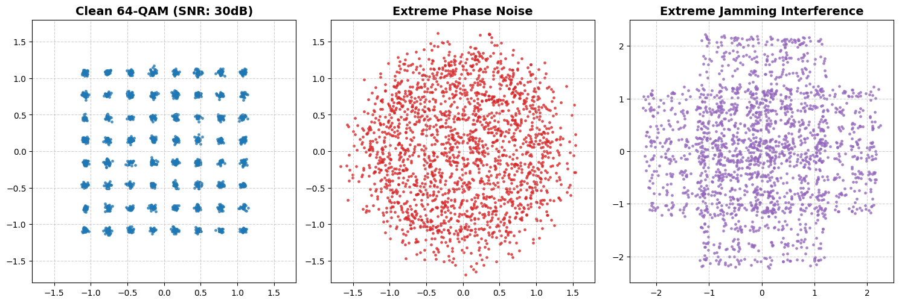
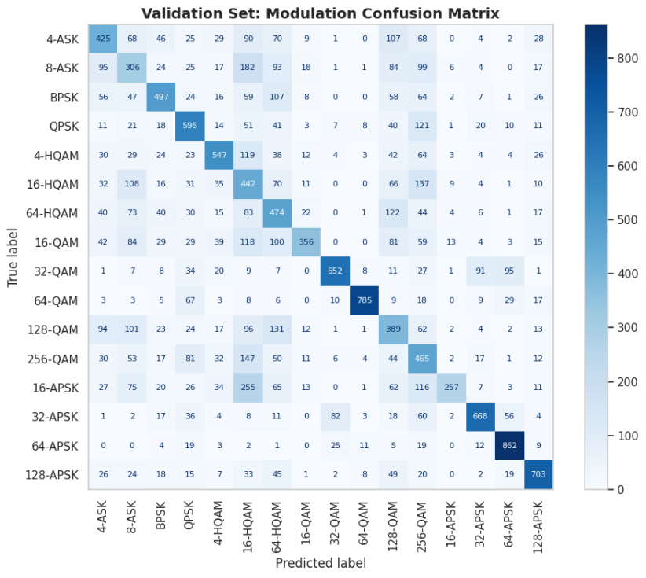
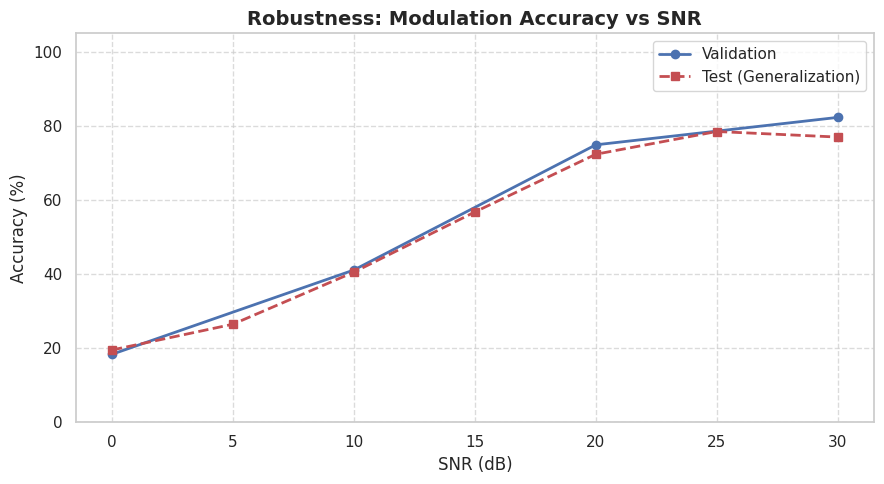
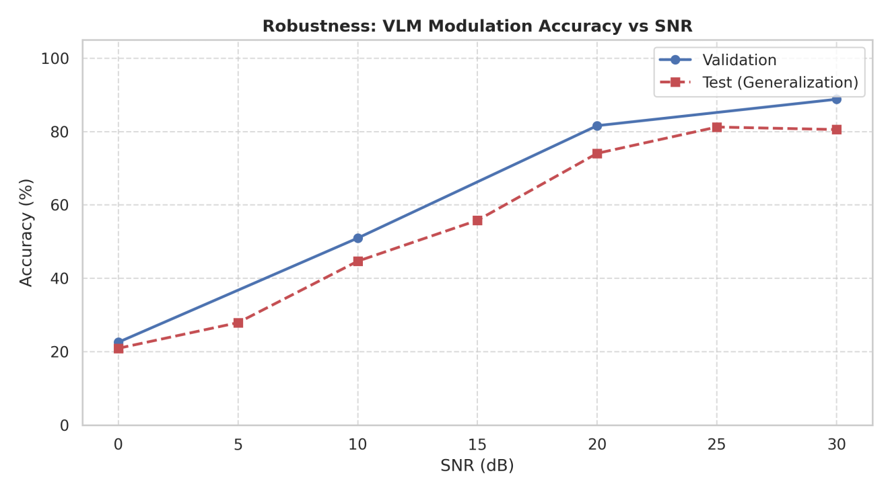
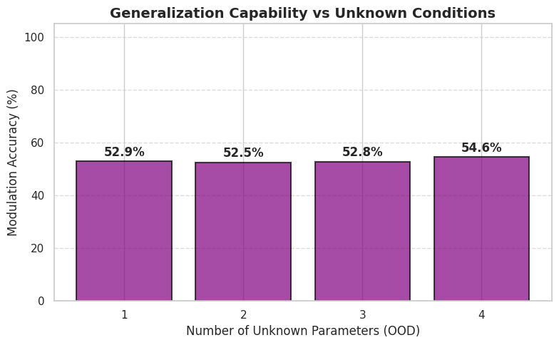
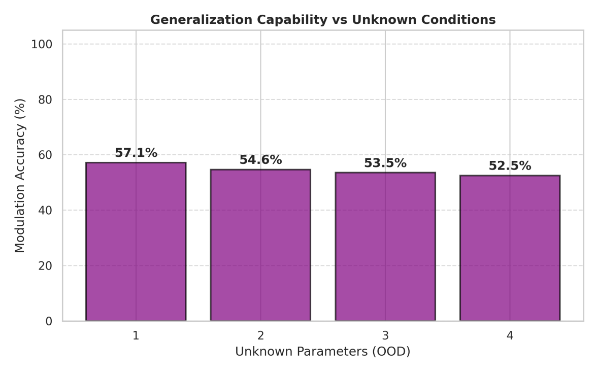

# Seeing Signals

> A comparative analysis of Convolutional Neural Networks and Multimodal Foundation Models for RF constellation diagnostics and out-of-distribution generalization.

  

## Overview

In modern radio frequency (RF) machine learning, the physical characteristics of wireless signals can be translated into geometric representations (constellation diagrams) for deep learning diagnostics. This repository contains the codebase and empirical findings of a comparative study that evaluates whether embedding a vision encoder within a large language-modeling framework provides a measurable advantage over traditional spatial feature extraction.

The project evaluates a custom lightweight **Deep Multi-Task CNN** against a Parameter-Efficient Fine-Tuned (PEFT) **Vision-Language Model (Qwen2-VL-2B-Instruct)**, with a primary focus on interpolative reasoning and out-of-distribution (OOD) generalization under unseen physical layer impairments.

## Core Contributions

* **First-Principles RF Data Engineering:** A highly optimized, custom synthetic data generation pipeline simulating 16 modulation schemes (including DVB-S2X APSK and optimal HQAM) corrupted by stochastic channel effects (Von Mises phase noise, Rapp-model amplitude distortion).
* **I/O Memory Optimization:** Implemented a direct-to-pixel mapping algorithm with binary bit-packing, reducing the dataset's memory footprint by 87.5% for high-speed streaming during DDP training.
* **Logit-based Probabilistic Inference:** Developed a zero-shot interpolation strategy that bypasses standard LLM text-generation constraints. By extracting raw token logits for discrete severity labels, the system computes a normalized expected value to perform continuous regression on unknown OOD conditions:
  $$\hat{y} = P(\text{"none"}) \cdot 0 + P(\text{"medium"}) \cdot 2 + P(\text{"extreme"}) \cdot 4$$

## Architectures Evaluated

### 1. Deep Multi-Task CNN (Baseline)
A ~9.5M parameter convolutional architecture optimized for real-time edge deployment. Features a shared backbone splitting into dedicated classification (Cross-Entropy) and regression (Huber Loss) heads.
* **Inference Speed:** 0.32 ms/sample
* **Hardware Profile:** Negligible memory footprint; fully trainable on cost-effective hardware (e.g., NVIDIA T4), though evaluated on an A100 for iso-hardware benchmarking.

### 2. Qwen2-VL-2B-Instruct (VLM)
A 2-billion parameter multimodal foundation model. Adapted via Low-Rank Adaptation (LoRA, r=16) across all linear modules to map high-frequency geometric artifacts to structured semantic vocabulary.
* **Inference Speed:** 1.62 ms/sample
* **Hardware Profile:** Requires robust GPU infrastructure (NVIDIA A100) due to significant VRAM requirements.

## Benchmarks & Results

### Feature Extraction (Validation on Known Distributions)
The VLM demonstrated superior feature extraction on known data, exhibiting higher accuracy in resolving densely packed, overlapping decision boundaries.

| CNN: Modulation Confusion Matrix | VLM: Modulation Confusion Matrix |
|:---:|:---:|
|  |  |

### Robustness to Low SNR 
Under extreme thermal noise conditions (0-10 dB), the VLM maintained a slightly more resilient accuracy floor compared to the baseline CNN.

| CNN: SNR Robustness | VLM: SNR Robustness |
|:---:|:---:|
|  |  |

### OOD Generalization & The Overfitting Gap
The models were evaluated against an Out-of-Distribution test set containing unseen, intermediate impairment severities (e.g., "Low" or "High" distortion). 

| CNN: OOD Generalization | VLM: OOD Generalization |
|:---:|:---:|
|  |  |

**Key Finding:** Despite its advanced cognitive architecture and initial accuracy advantage, the VLM suffers a steep degradation as unknown physical parameters accumulate. It overfits to the semantic boundaries of its training data and ultimately converges to the same error floor as the CNN (~52.5%). The CNN proved to be a highly stable and predictable architecture for instantaneous signal classification in unexplored RF environments.

## Repository Structure

* `01_Dataset_Simulation/`
  * `signal_utils.py` - Core mathematical models for baseband generation and impairments.
  * `generate_train_val.py` & `generate_train.py` - Fast data synthesis and bit-packed compilation.
  * `generate_sep_snr_plot.py` - Theoretical Symbol Error Probability (SEP) simulations.
* `02_Deep_Learning_CNN/`
  * `model.py` - Hybrid Deep Multi-Task CNN definition.
  * `train.py` & `evaluation.py` - CNN training loop and validation metrics.
  * `dataset.py` - PyTorch dataloaders for the baseline architecture.
* `03_Vision_Language_Model/`
  * `dataset.py` - Multi-task prompt templating and conversational formatting.
  * `train.py` - Distributed HF Trainer setup and LoRA adapter injection.
  * `evaluation.py` - Logit-based inference engine for continuous regression.

## Getting Started

**Prerequisites:** Python 3.10+, PyTorch, and a CUDA-enabled GPU (A100 recommended for the VLM).

Run the following commands in your terminal:

    # Clone the repository
    git clone https://github.com/YourUsername/seeing-signals.git
    cd seeing-signals
    pip install -r requirements.txt

    # 1. Generate the synthetic dataset
    cd 01_Dataset_Simulation
    python generate_train_val.py
    python generate_train.py
    cd ..

    # 2. Train the baseline CNN
    cd 02_Deep_Learning_CNN
    python train.py
    cd ..

    # 3. Fine-tune the Vision-Language Model (Requires Multi-GPU)
    cd 03_Vision_Language_Model
    torchrun --nproc_per_node=2 train.py

## 👥 Authors

This project was collaboratively developed as a joint research and engineering effort by:

* **Nektarios Psathas** – [GitHub](https://github.com/Nekthecool)
* **Angelos Sachmpazidis** – [GitHub](https://github.com/Angel-Sach)

*Both engineers contributed equally to the theoretical mathematical modeling, the implementation of the Deep Learning architectures, and the final empirical evaluation.*

## Acknowledgements
This research was supported by the Digital Governance Unit of the Aristotle University of Thessaloniki (AUTh). Compute resources were provided by the National Infrastructures for Research and Technology (GRNET) and funded through the EU Recovery and Resilience Facility.
